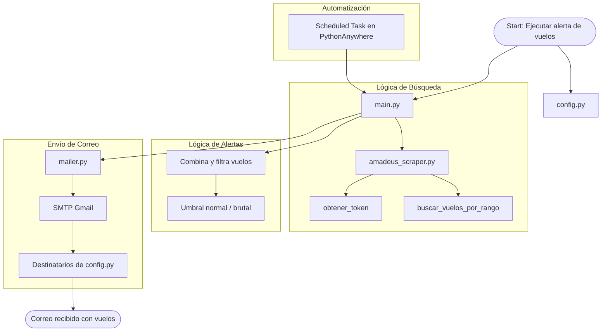

# ✈️ Amadeus Flight Alert Bot

Este proyecto automatiza la búsqueda de vuelos entre dos ciudades usando la API de Amadeus, analiza las combinaciones más económicas y envía por correo electrónico las mejores ofertas cada 12 horas. Ideal para encontrar vuelos baratos entre fechas específicas.

---

## 🚀 Características

- ✅ Consulta vuelos desde Amadeus API (modo sandbox o productivo)
- ✅ Combina vuelos de ida y regreso, y los ordena por precio
- ✅ Alerta si hay vuelos con precios muy bajos (por debajo de umbrales definidos)
- ✅ Envío automático de correos con las mejores combinaciones
- ✅ Formato legible para humanos
- ✅ Programado en Python con estructura modular
- ✅ Configurable fácilmente desde un solo archivo
- ✅ Ejecutable en **PythonAnywhere** u otro servidor con tareas programadas

---

## 📁 Estructura del proyecto
---
```
amadeus-alert/
│
├── main.py # Script principal que ejecuta todo
├── config.py # Fechas, umbrales y correos
├── utils/
│   ├── amadeus_scraper.py # Lógica de scraping de vuelos vía Amadeus
│   └── mailer.py # Envío de correos por SMTP
├── .env # (Opcional) Claves privadas si decides usar dotenv
├── requirements.txt # Dependencias del proyecto
└── README.md # Este archivo
```
## 🔑 Credenciales necesarias:

- **API de Amadeus**: Regístrate gratis en https://developers.amadeus.com, crea una aplicación y copia tu `CLIENT_ID` y `CLIENT_SECRET`.
- **Correo de envío**: Usa un correo Gmail con autenticación de dos pasos y genera una contraseña de aplicación desde tu cuenta.

---

## ⚙️ Configuración Inicial

### 1. Clona el repositorio
```bash
git clone https://github.com/tuusuario/amadeus-alert.git
cd amadeus-alert
```

### 2. (Opcional) Crea un entorno virtual
```bash
# En Linux/macOS
python3 -m venv venv
source venv/bin/activate

# En Windows
python -m venv venv
venv\Scripts\activate
```

### 3. Instala las dependencias
```bash
pip install -r requirements.txt
```

### 4. Configura `config.py` con tus valores
```python
ORIGEN = "BOG"
DESTINO = "YUL"
FECHAS_IDA = ["2025-07-28", "2025-07-29"]
FECHAS_REGRESO = ["2025-08-01", "2025-08-02"]
UMBRAL_NORMAL = 600
UMBRAL_BRUTAL = 350
DESTINATARIOS = ["tunombre@correo.com"]
```

### 5. Añade tus credenciales de correo en `utils/mailer.py`
```python
email_remitente = "tucorreo@gmail.com"
password = "tu_clave_de_aplicación"
```

### 6. Añade tus credenciales Amadeus en `utils/amadeus_scraper.py`
```python
CLIENT_ID = "TU_CLIENT_ID"
CLIENT_SECRET = "TU_CLIENT_SECRET"
```

---

## 🧪 Ejecución Manual
```bash
python main.py
```

## 🕐 Automatización (ejemplo con PythonAnywhere)
```bash
/home/tu_usuario/.virtualenvs/venv/bin/python3.10 /home/tu_usuario/amadeus-alert/main.py
```
> Elige el intervalo de repetición (cada 12h, por ejemplo).

---

## 📬 Ejemplo de Correo

### 🛫 Vuelos BOG ⇄ YUL actualizados

Top 3 combinaciones completas BOG ⇄ YUL (2025-07-28 - 2025-08-02):

💼 **Total:** $392.75 USD  
🛫 **Ida:** Avianca AV92  
🕓 2025-07-28 04:15 → 2025-07-28 10:40 (6h25m, 0 escalas)  
🔗 [Ver en Skyscanner](https://www.skyscanner.com/...)

🛬 **Regreso:** Air Canada AC187  
🕓 2025-08-02 13:00 → 2025-08-02 19:30 (6h30m, 1 escala)  
🔗 [Ver en Skyscanner](https://www.skyscanner.com/...)

...

Top 3 **solo IDA**:  
...

Top 3 **solo REGRESO**:  
...

---


## 🔐 Seguridad

- ⚠️ Este proyecto usa archivos `.py` como `config.py`, `mailer.py` y `amadeus_scraper.py` para almacenar credenciales y configuraciones.
- ❌ **No subas** tus claves API ni contraseñas a GitHub si haces público tu repositorio.
- ✅ Para una mayor seguridad, considera migrar a un archivo `.env` y usar la librería `python-dotenv`.
- ✅ Si usas Git, añade un `.gitignore` para evitar subir archivos sensibles:

```gitignore
.env
__pycache__/
*.pyc
```

---

## 📌 Dependencias
- `requests`  
- `python-dotenv` (opcional pero recomendado)

## Arquitectura del Proyecto: Rastreador de Vuelos



